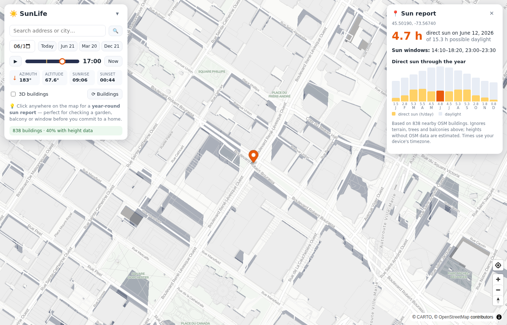
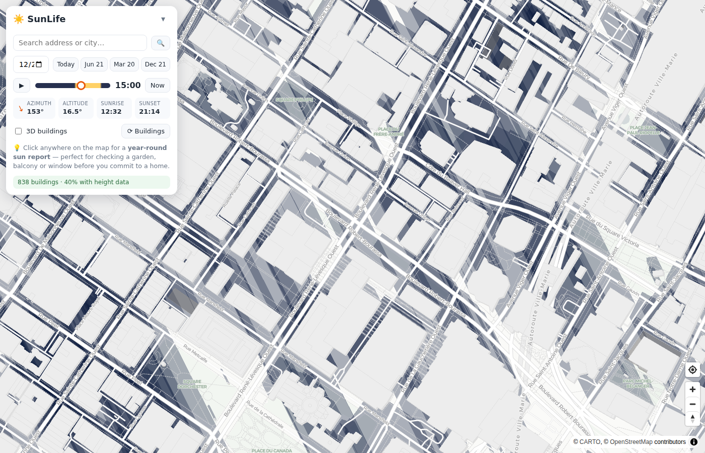

# ☀️ SunLife

**An open-source sun & shadow explorer for home hunting.** See exactly how
sunlight falls on any address — at any time, on any day of the year — using
real building shapes and heights from OpenStreetMap. Inspired by
[Shadowmap](https://shadowmap.org), but free, self-hostable and hackable.

> Buying or renting a place where sunlight matters? Don't trust a single
> sunny-afternoon viewing. Check what the **winter solstice** does to that
> garden before you sign.


*Click any spot to get its direct-sun windows for the day and a month-by-month
chart of direct sun hours through the year.*


*December 21, low morning sun: long shadows reveal which homes spend winter in
the dark.*

## Features

- 🗺️ **Live shadow map** — building shadows computed from OpenStreetMap
  footprints and heights, rendered for any date and time
- 🕐 **Time scrubber** — drag through the day (or press ▶ to animate) and watch
  shadows sweep across a neighborhood
- 📅 **Solstice presets** — one click to compare June 21, the equinox and
  December 21 (the worst case that sells or sinks a south-facing garden)
- 📍 **Year-round sun report** — click any point (garden, balcony, kitchen
  window) and get its direct-sun windows for the selected day plus hours of
  direct sun per month, accounting for every surrounding building
- 🏙️ **3D building view** — toggle extruded buildings to sanity-check heights
- 🔎 **Address search** (Nominatim) and geolocation
- 🔗 **Shareable URLs** — the map position lives in the URL hash, so you can
  bookmark each home you're considering

No build step, no API keys, no backend, no tracking. A static page you can
open locally or host anywhere.

## Quick start

```sh
git clone https://github.com/pjleduc/sunlife.git
cd sunlife
python3 -m http.server 8000   # or: npx http-server -p 8000
# open http://localhost:8000
```

Then:

1. Search for an address you're considering (or pan/zoom to it). Buildings
   load automatically from zoom 15.
2. Scrub the time slider and flip between **Jun 21 / Mar 20 / Dec 21**.
3. Click the garden / balcony / window you care about and read the
   **sun report**: total direct-sun hours today and per month across the year.

### Hosting (GitHub Pages)

The app is plain static files. Enable **Settings → Pages → Deploy from a
branch** on the repository root and it's live.

## How it works

- **Sun position** — [SunCalc](https://github.com/mourner/suncalc) (vendored in
  `vendor/`) gives the sun's azimuth and altitude for any time and place.
- **Buildings** — footprints and heights are fetched from the
  [Overpass API](https://wiki.openstreetmap.org/wiki/Overpass_API). Heights use
  the `height` tag when present, `building:levels × 3.2 m` as a fallback, and
  an 8 m default otherwise (the status bar shows how much real height data your
  area has).
- **Shadows** — each footprint is swept along the shadow vector
  (`length = height / tan(altitude)`). Sun-facing edge runs become strip
  polygons, which tile the swept region exactly for convex footprints with no
  expensive polygon unions — fast enough to recompute every frame while you
  scrub time.
- **Sun reports** — for each time sample of the day, a ray is cast from your
  point toward the sun; an obstacle blocks it if the building is taller than
  `distance × tan(altitude)` where the ray crosses its footprint. Sampling
  every 10 minutes (15 for the yearly chart) over all nearby buildings gives
  direct-sun windows and monthly totals.

Core math lives in [`src/geometry.js`](src/geometry.js) — pure functions,
covered by unit tests (`node --test`).

## Accuracy & limitations

- **Terrain is assumed flat.** Hills, ridges and valley walls are not
  considered (a big deal in mountainous areas — see roadmap).
- **Trees and vegetation are not modeled** — OSM rarely has usable canopy data.
- **Heights are only as good as OSM.** In areas with little height data, most
  buildings fall back to estimates. The status bar and each sun report tell you
  how much is estimated; treat low-coverage areas with skepticism.
- **Reports are computed at ground level.** A 3rd-floor balcony gets more sun
  than the pavement below it.
- **Times use your device's timezone**, which is what you want when exploring
  homes near where you live, but is misleading for far-away cities.
- Only buildings loaded in/near the current view are considered, and obstacles
  beyond ~1.2 km from a report point are ignored.

## Data sources & licenses

| Component | Source | License |
| --- | --- | --- |
| Building data | © [OpenStreetMap](https://www.openstreetmap.org/copyright) contributors via Overpass API | ODbL |
| Basemap tiles | [CARTO Positron](https://carto.com/basemaps/) (OSM data) | free for non-commercial use |
| Geocoding | [Nominatim](https://nominatim.org/) | usage policy applies |
| Sun math | [SunCalc](https://github.com/mourner/suncalc) | BSD-2-Clause |
| Map renderer | [MapLibre GL JS](https://maplibre.org/) | BSD-3-Clause |

Please be considerate of the free Overpass/Nominatim/CARTO services. If you
deploy this for heavy public use, run your own
[Overpass instance](https://wiki.openstreetmap.org/wiki/Overpass_API/Installation)
and switch the basemap (both are single constants at the top of
`src/buildings.js` / `src/app.js`).

## Development

```sh
node --test        # run the geometry/parsing unit tests
```

No dependencies, no bundler: edit, refresh, done.

## Roadmap

- [ ] Terrain occlusion from a DEM (e.g. AWS Terrain Tiles / Mapzen terrarium)
- [ ] Report height offset ("my balcony is on the 3rd floor")
- [ ] Annual sun-hours heatmap overlay for a whole neighborhood
- [ ] Compare mode: pin several candidate homes side by side
- [ ] Permalinks that include date/time and report point

Contributions welcome — open an issue or PR.

## License

[MIT](LICENSE)
