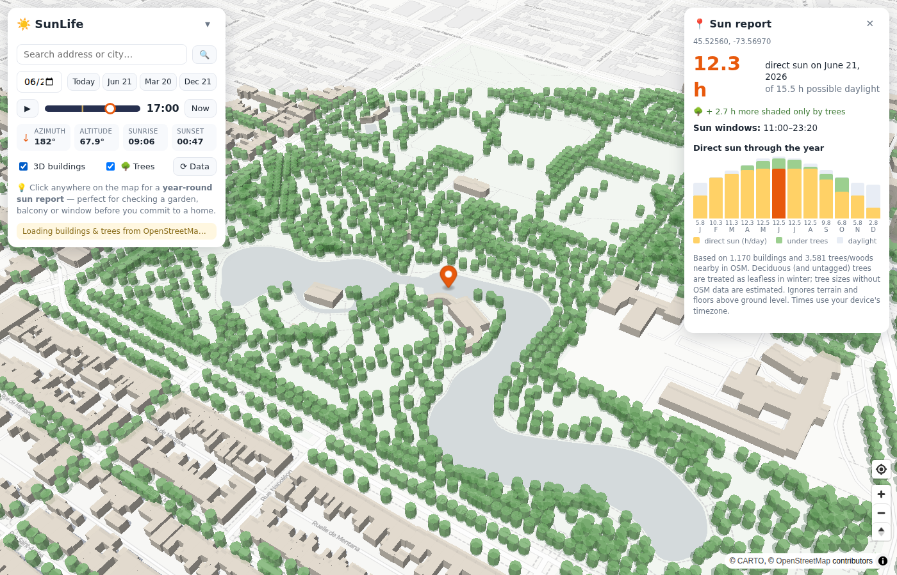

# ☀️ SunLife

**🔗 Live app: [pjleduc.github.io/sunlife](https://pjleduc.github.io/sunlife/)** — installable as an app via your browser's *Install* button or *Add to Home Screen*.

**An open-source sun & shadow explorer for home hunting.** See exactly how
sunlight falls on any address — at any time, on any day of the year — using
real building shapes and heights from OpenStreetMap. Inspired by
[Shadowmap](https://shadowmap.org), but free, self-hostable and hackable.

> Buying or renting a place where sunlight matters? Don't trust a single
> sunny-afternoon viewing. Check what the **winter solstice** does to that
> garden before you sign.


*Click any spot to get its direct-sun windows for the day and a month-by-month
chart of direct sun hours through the year.*


*Trees, hedges and woodland cast shade too — with elevated canopies and
seasonal leaf cycles. The report separates "direct sun" from "shaded only by
trees" (gold vs. green bars).*


*December 21, low morning sun: long shadows reveal which homes spend winter in
the dark.*

## Features

- 🗺️ **Live shadow map** — building shadows computed from OpenStreetMap
  footprints and heights, rendered for any date and time
- 🕐 **Time scrubber** — drag through the day (or press ▶ to animate) and watch
  shadows sweep across a neighborhood
- 📅 **Solstice presets** — one click to compare June 21, the equinox and
  December 21 (the worst case that sells or sinks a south-facing garden)
- 📍 **Year-round sun report** — click any point (garden, balcony, kitchen
  window) and get its direct-sun windows for the selected day plus hours of
  direct sun per month, accounting for every surrounding building and tree
- 🌳 **Tree & vegetation shade** — individual trees, tree rows, hedges and
  woodland from OSM cast shadows too, with **elevated canopies** (low sun
  passes under a crown) and **seasonal leaf cycles**: deciduous trees stop
  blocking sun in winter, so a maple-lined street stays bright in January.
  Reports split "direct sun" from "shaded only by trees"
- 🏙️ **3D building view** — toggle extruded buildings and floating tree
  canopies to sanity-check heights
- 🔎 **Address search** (Nominatim) and geolocation
- 🔗 **Shareable URLs** — the map position lives in the URL hash, so you can
  bookmark each home you're considering

No build step, no API keys, no backend, no tracking. A static page you can
open locally or host anywhere.

## Quick start

**In your browser (hosted):** once GitHub Pages is enabled for this repository
(the included `deploy.yml` workflow publishes automatically on every push to
`main` — the repo must be public on a free GitHub plan), the app lives at:

> **https://pjleduc.github.io/sunlife/**

SunLife is a **PWA**: open that URL and use your browser's *Install app*
button (Chrome/Edge address bar) or *Share → Add to Home Screen* (iPhone/iPad)
to install it like a native app — handy for checking sun on-site during a
viewing.

**Locally:**

```sh
git clone https://github.com/pjleduc/sunlife.git
cd sunlife
python3 -m http.server 8000   # or: npx http-server -p 8000
# open http://localhost:8000
```

Then:

1. Search for an address you're considering (or pan/zoom to it). Buildings
   load automatically from zoom 15.
2. Scrub the time slider and flip between **Jun 21 / Mar 20 / Dec 21**.
3. Click the garden / balcony / window you care about and read the
   **sun report**: total direct-sun hours today and per month across the year.

### Hosting (GitHub Pages)

The app is plain static files; `.github/workflows/deploy.yml` syncs `main` to
the `gh-pages` branch on every push, which GitHub Pages serves. On a free
GitHub plan the repository must be **public** for Pages to work. (The branch
route is used because the default workflow token lacks the admin permission
needed to create a Pages site for the artifact-based flow.)

## How it works

- **Sun position** — [SunCalc](https://github.com/mourner/suncalc) (vendored in
  `vendor/`) gives the sun's azimuth and altitude for any time and place.
- **Buildings** — footprints and heights are fetched from the
  [Overpass API](https://wiki.openstreetmap.org/wiki/Overpass_API). Heights use
  the `height` tag when present, `building:levels × 3.2 m` as a fallback, and
  an 8 m default otherwise (the status bar shows how much real height data your
  area has). `min_height` is honored for bridges and arches.
- **Trees** — `natural=tree` nodes become octagonal crowns (default 12 m tall,
  8 m wide, crown base at 30% of height), `natural=tree_row` and
  `barrier=hedge` ways become buffered strips, and `natural=wood` /
  `landuse=forest` / `landcover=trees` areas become closed canopy. OSM
  `height`, `est_height`, `diameter_crown`, `leaf_cycle` and `leaf_type` tags
  are used when present. Deciduous trees (the default for untagged trees;
  hedges default to evergreen) are removed from the simulation during the
  leafless season — April–October is leaf-on in the northern hemisphere,
  reversed in the southern.
- **Shadows** — each footprint is swept along the shadow vector
  (`length = height / tan(altitude)`). Sun-facing edge runs become strip
  polygons, which tile the swept region exactly for convex footprints with no
  expensive polygon unions — fast enough to recompute every frame while you
  scrub time.
- **Sun reports** — for each time sample of the day, a ray is cast from your
  point toward the sun; an obstacle blocks it if the building is taller than
  `distance × tan(altitude)` where the ray crosses its footprint. Sampling
  every 10 minutes (15 for the yearly chart) over all nearby buildings gives
  direct-sun windows and monthly totals.

Core math lives in [`src/geometry.js`](src/geometry.js) — pure functions,
covered by unit tests (`node --test`).

## Accuracy & limitations

- **Terrain is assumed flat.** Hills, ridges and valley walls are not
  considered (a big deal in mountainous areas — see roadmap).
- **Tree cover is only as good as OSM mapping.** Many neighborhoods have few
  or no trees mapped, and most mapped trees lack height/crown/leaf tags, so
  defaults are used. The 🌳 toggle lets you exclude trees entirely if you
  don't trust local coverage. Trees in leaf are treated as fully opaque;
  leafless deciduous trees as fully transparent — reality is in between.
- **Heights are only as good as OSM.** In areas with little height data, most
  buildings fall back to estimates. The status bar and each sun report tell you
  how much is estimated; treat low-coverage areas with skepticism.
- **Reports are computed at ground level.** A 3rd-floor balcony gets more sun
  than the pavement below it.
- **Times use your device's timezone**, which is what you want when exploring
  homes near where you live, but is misleading for far-away cities.
- Only buildings loaded in/near the current view are considered, and obstacles
  beyond ~1.2 km from a report point are ignored.

## Data sources & licenses

| Component | Source | License |
| --- | --- | --- |
| Building & tree data | © [OpenStreetMap](https://www.openstreetmap.org/copyright) contributors via Overpass API | ODbL |
| Basemap tiles | [CARTO Positron](https://carto.com/basemaps/) (OSM data) | free for non-commercial use |
| Geocoding | [Nominatim](https://nominatim.org/) | usage policy applies |
| Sun math | [SunCalc](https://github.com/mourner/suncalc) | BSD-2-Clause |
| Map renderer | [MapLibre GL JS](https://maplibre.org/) | BSD-3-Clause |

Please be considerate of the free Overpass/Nominatim/CARTO services. If you
deploy this for heavy public use, run your own
[Overpass instance](https://wiki.openstreetmap.org/wiki/Overpass_API/Installation)
and switch the basemap (both are single constants at the top of
`src/buildings.js` / `src/app.js`).

## Development

```sh
node --test        # run the geometry/parsing unit tests
```

No dependencies, no bundler: edit, refresh, done.

## Related projects

Surveyed before building tree support (June 2026) — none offered an open,
self-hostable shadow simulator with vegetation:

- [Shadowmap](https://app.shadowmap.org/) — polished commercial 3D product;
  closed source.
- [ShadeMap](https://shademap.app/) and its
  [leaflet-](https://github.com/ted-piotrowski/leaflet-shadow-simulator)/
  [mapbox-gl-shadow-simulator](https://github.com/ted-piotrowski/mapbox-gl-shadow-simulator)
  libraries — excellent GPU shadow rendering incl. terrain, and tree shadows in
  the app, but the libraries require an API key from shademap.app and ship as
  minified bundles; the vegetation data is a proprietary service.
- [perliedman/shadow-mapper](https://github.com/perliedman/shadow-mapper) —
  true open source (ISC) with OSM buildings + elevation, but Python 2,
  archived since 2020, no vegetation.
- [UMEP/SOLWEIG](https://umep-docs.readthedocs.io/) — academic QGIS plugin
  that does model vegetation shadows rigorously, but it's a desktop GIS
  research tool, not a web map.

## Roadmap

- [x] Tree, hedge and woodland shade from OSM with seasonal leaf cycles
- [ ] Terrain occlusion from a DEM (e.g. AWS Terrain Tiles / Mapzen terrarium)
- [ ] Partial transparency for leafless deciduous crowns (~40% blocking)
- [ ] Report height offset ("my balcony is on the 3rd floor")
- [ ] Annual sun-hours heatmap overlay for a whole neighborhood
- [ ] Compare mode: pin several candidate homes side by side
- [ ] Permalinks that include date/time and report point

Contributions welcome — open an issue or PR.

## License

[MIT](LICENSE)
